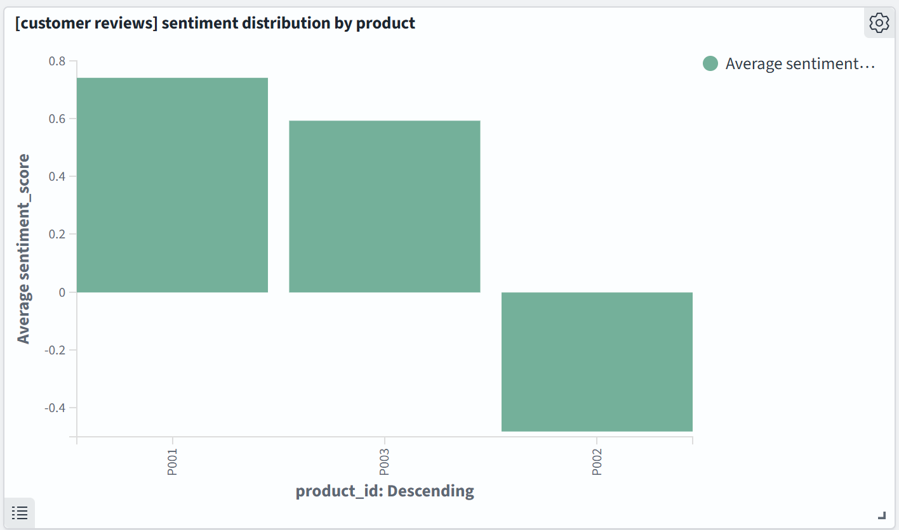
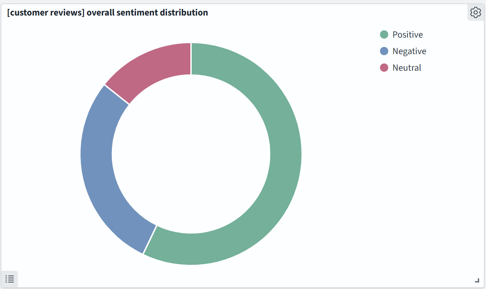

# opensearch-sentiment-analyzer

This project implements a sentiment analysis system for OpenSearch, automatically analyzing and scoring the sentiment of customer reviews as they are ingested into the `customer_reviews` index. 

It consists of three main components:
- OpenSearch cluster
- Sentiment Analysis Plugin for OpenSearch
- Sentiment Analysis Service

This is a customer_reviews dashboard visualization showing a vertical bar chart representing the average sentiment score of customer reviews received per product during the selected timeframe.



A customer_reviews dashboard visualization showing a donut (pie) chart representing the number of positive, negative and neutral reviews received during the selected timeframe.



## Sentiment Analysis for OpenSearch

The system uses a custom OpenSearch plugin that intercepts new documents being added to a specified index, sends the review text to an external sentiment analysis service, and then enriches the document with sentiment score and category before it's indexed.

Project Structure:
- docker-compose.yml: Defines the services \
(OpenSearch, OpenSearch Dashboards, Sentiment Analysis Service)
- sentiment-analysis-plugin/: Contains the OpenSearch plugin source code
- sentiment-analysis-service/: Contains the Python-based sentiment analysis service

### Prerequisites

- Docker and Docker Compose
- Java Development Kit (JDK) 11 or later
- Gradle

### Installation and Setup

1. Clone the repository:
```
git clone https://github.com/raviteja-reddy-guntaka/opensearch-sentiment-analyzer.git
cd opensearch-sentiment-analyzer
```
2. Start the services:
```
docker-compose up -d
```
3. Build and install the sentiment analysis plugin:
```
cd sentiment-analysis-plugin
./gradlew build
docker cp build/distributions/sentiment-analysis-plugin-1.0.zip opensearch-local-1:/tmp/
docker cp build/distributions/sentiment-analysis-plugin-1.0.zip opensearch-local-1:/tmp/
docker exec -it opensearch-local-1 sh
opensearch-plugin install file:/tmp/sentiment-analysis-plugin-1.0.zip
exit
docker restart opensearch-local-1
cd ..
```
4. Create the customer reviews index and set up the pipeline:\
Use the OpenSearch Dashboards Dev Tools (http://localhost:5601/app/dev_tools#/console) to run:
```
PUT /customer_reviews
{
  "mappings": {
    "properties": {
      "review_id": { "type": "keyword" },
      "product_id": { "type": "keyword" },
      "customer_id": { "type": "keyword" },
      "review_text": { "type": "text" },
      "review_date": { "type": "date" },
      "sentiment_score": { "type": "float" }
    }
  }
}

PUT _ingest/pipeline/sentiment-analysis-pipeline
{
  "description": "Pipeline to add sentiment scores",
  "processors": [
    {
      "sentiment_analysis": {}
    }
  ]
}

PUT customer_reviews/_settings
{
  "index.default_pipeline": "sentiment-analysis-pipeline"
}
```
### Usage

To add a new document to `customer_reviews` with automatic sentiment analysis:
```
POST /customer_reviews/_doc
{
    "review_id": "43",
    "product_id": "P001242",
    "customer_id": "C00193",
    "review_text": "Not worth the money",
    "review_date": "2025-01-10"
}
```

The document will be automatically enriched with `sentiment_score` and `sentiment_category` fields.

### Testing

To test the sentiment analysis service directly:
```
curl -X POST http://localhost:5000/analyze
-H "Content-Type: application/json"
-d '{"text": "This is a test message!"}'
```

### Troubleshooting

- If you need to remove the plugin:
```
docker exec -it opensearch-local-1 sh
opensearch-plugin remove sentiment-analysis
exit
```
- Check OpenSearch logs:
```
docker logs opensearch-local-1
```
- Check Sentiment Analysis Service logs:
```
docker logs sentiment-analysis-service-1
```

### License

This project is licensed under the Apache License - see the [LICENSE](LICENSE) file for details.